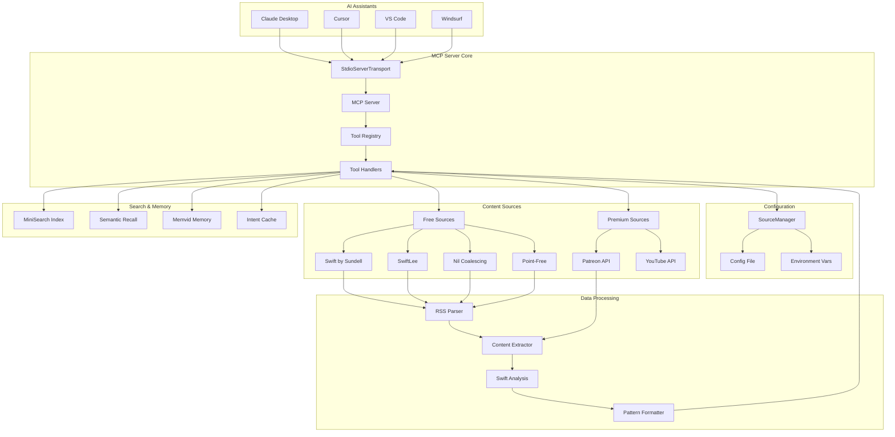
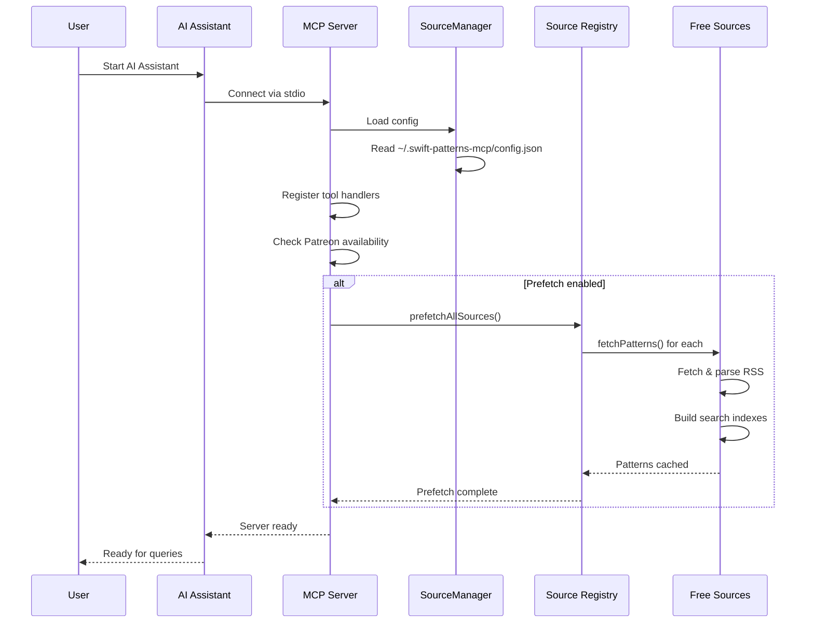
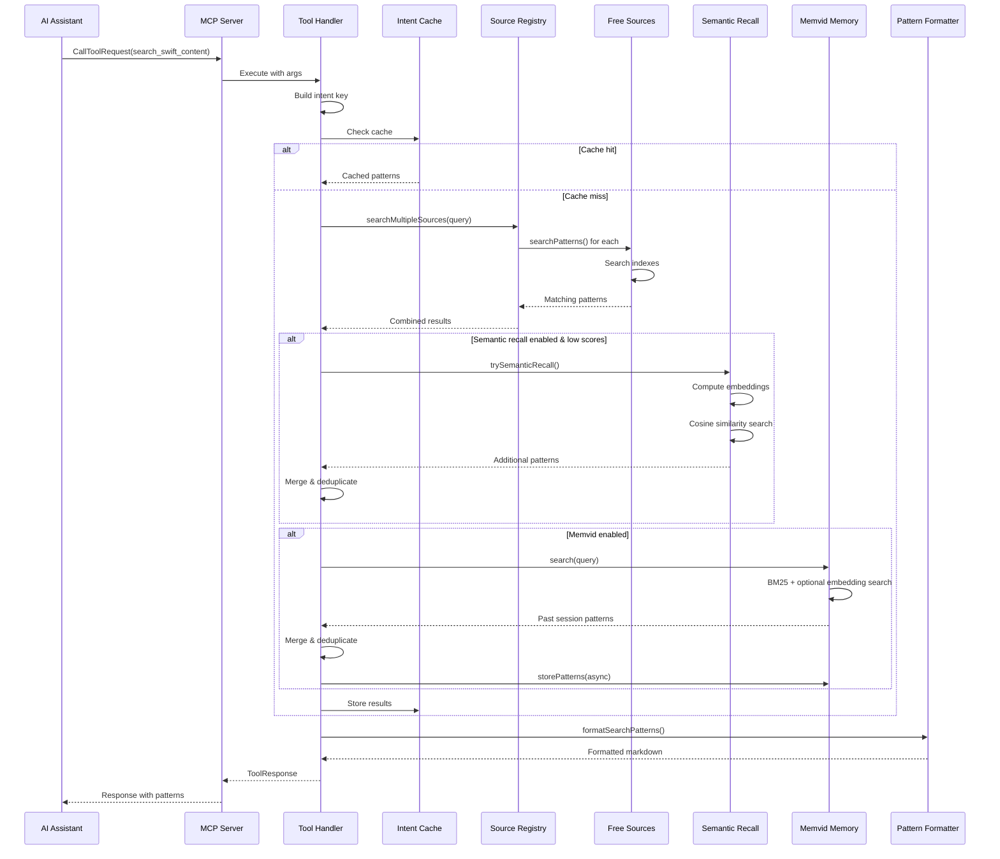
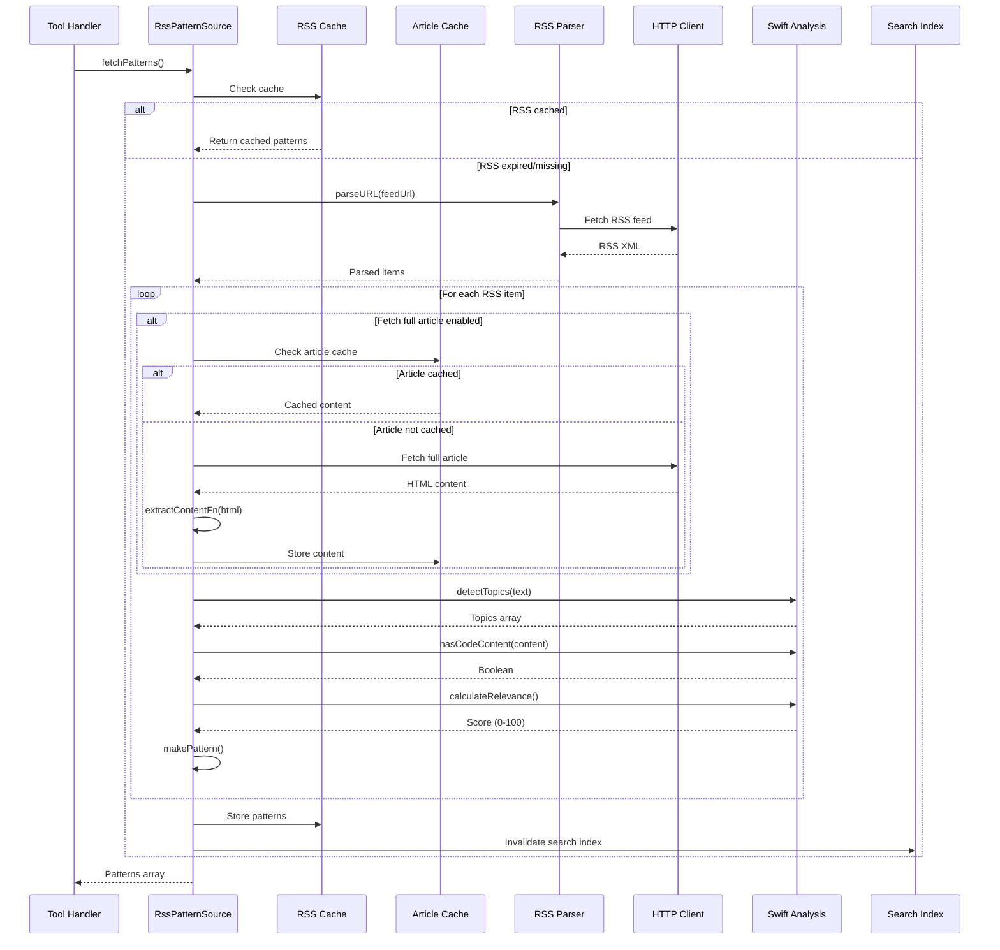
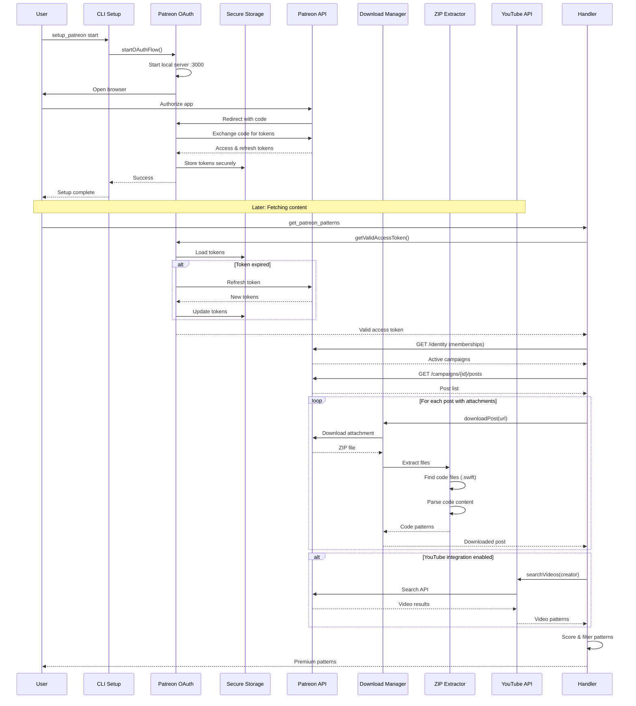
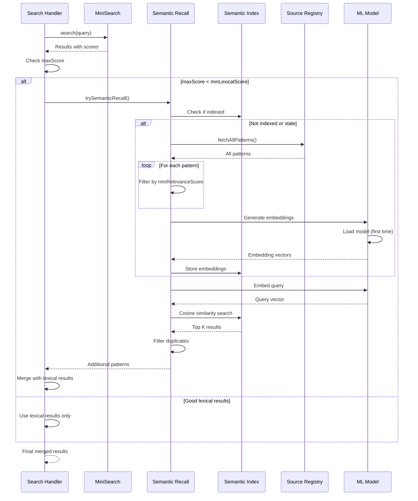
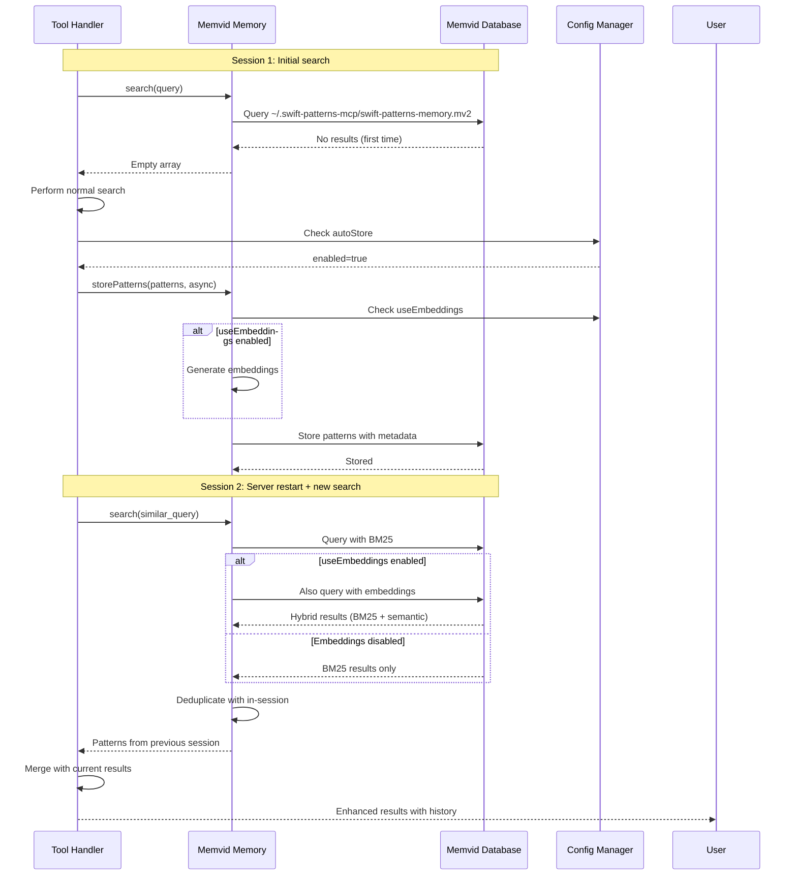

# swift-patterns-mcp Architecture

## Overview

**swift-patterns-mcp** is a Model Context Protocol (MCP) server that provides AI assistants with access to curated Swift and SwiftUI best practices from leading iOS developers. It aggregates content from free sources (RSS feeds, GitHub) and optional premium sources (Patreon), offering intelligent search, persistent memory, and semantic recall capabilities.

## System Architecture



## Core Components

### 1. MCP Server (`src/index.ts`)

The main entry point that initializes and runs the MCP server.

**Responsibilities:**
- Initialize MCP server with StdioServerTransport
- Register tool handlers
- Handle tool execution requests
- Manage source prefetching
- Configure server capabilities

**Key Features:**
- Dynamic tool registration based on enabled sources
- Conditional Patreon tool availability
- Background source prefetching for performance
- Centralized error handling

### 2. Tool System

#### Tool Registry (`src/tools/registry.ts`)

A centralized registry pattern for managing tool handlers.

**Pattern:** Registry + Factory
- Maps tool names to handler functions
- Provides type-safe handler retrieval
- Supports dynamic tool registration

#### Tool Handlers (`src/tools/handlers/`)

Individual handlers for each MCP tool:

1. **`get_swift_pattern`** - Search free sources by topic
2. **`search_swift_content`** - Search all enabled sources with code filtering
3. **`list_content_sources`** - List available sources and their status
4. **`enable_source`** - Enable/disable content sources
5. **`setup_patreon`** - Configure Patreon integration
6. **`get_patreon_patterns`** - Search premium Patreon content

Each handler follows a consistent pattern:
- Validate input arguments
- Load configuration from SourceManager
- Execute search/retrieval operations
- Apply filtering and scoring
- Format results for AI consumption
- Cache results for performance

### 3. Source Management

#### SourceManager (`src/config/sources.ts`)

Central configuration manager for all content sources.

**Responsibilities:**
- Load/save configuration from `~/.swift-patterns-mcp/config.json`
- Track enabled/disabled sources
- Validate source authentication
- Manage feature flags (prefetch, semantic recall, memvid)
- Provide configuration API to handlers

**Configuration Structure:**
```typescript
{
  sources: {
    sundell: { enabled: true, configured: true },
    vanderlee: { enabled: true, configured: true },
    nilcoalescing: { enabled: true, configured: true },
    pointfree: { enabled: true, configured: true },
    patreon: { enabled: false, configured: false }
  },
  prefetchSources: true,
  semanticRecall: {
    enabled: false,
    minLexicalScore: 0.35,
    minRelevanceScore: 70
  },
  memvid: {
    enabled: true,
    autoStore: true,
    useEmbeddings: false,
    embeddingModel: 'bge-small'
  }
}
```

#### Source Registry (`src/utils/source-registry.ts`)

Factory and facade for free source instances.

**Pattern:** Singleton + Factory + Facade
- Creates and caches source instances
- Provides unified API for searching multiple sources
- Handles partial failures gracefully with `Promise.allSettled`
- Manages source prefetching

### 4. Content Sources

#### Free Sources (`src/sources/free/`)

RSS-based sources that extend `RssPatternSource` base class:

**Base Class: RssPatternSource** (`src/sources/free/rssPatternSource.ts`)

Template method pattern for RSS-based sources:

```typescript
abstract class RssPatternSource<T extends BasePattern> {
  // Template methods (implemented by base)
  async fetchPatterns(): Promise<T[]>
  async searchPatterns(query: string): Promise<T[]>
  protected async processRssItem(item: Parser.Item): Promise<T>
  protected async processArticle(item: Parser.Item): Promise<T>
  
  // Hook methods (implemented by subclasses)
  protected makePattern(obj: BasePattern): T
  protected extractContentFn?(html: string): string
}
```

**Implementations:**

1. **SundellSource** - Swift by Sundell RSS feed
2. **VanderLeeSource** - SwiftLee RSS feed with full article scraping
3. **NilCoalescingSource** - Nil Coalescing RSS feed
4. **PointFreeSource** - Point-Free GitHub releases

Each source:
- Defines topic keywords and quality signals
- Implements content extraction (if needed)
- Caches RSS feeds and articles
- Maintains a search index

#### Premium Sources (`src/sources/premium/`)

**PatreonSource** (`src/sources/premium/patreon.ts`)

Integrates with Patreon API to access premium content.

**Features:**
- OAuth 2.0 authentication flow
- Fetches user's active subscriptions
- Downloads posts with attachments (ZIP files)
- Extracts code from downloaded content
- Integrates YouTube video search for creators
- Filters and scores content for Swift relevance

**Dependencies:**
- `patreon-oauth.ts` - OAuth token management with refresh
- `patreon-dl.ts` - Post download and attachment handling
- `patreon-zip.ts` - ZIP file extraction and code parsing
- `youtube.ts` - YouTube Data API integration

### 5. Search & Intelligence

#### MiniSearch Index (`src/utils/search.ts`)

Full-text search engine with fuzzy matching.

**Features:**
- Porter stemming for better matches
- Fuzzy search with configurable threshold
- Field boosting (title > topics > content)
- Prefix matching for partial queries
- Custom tokenization with hyphen handling

**Classes:**

1. **SearchIndex** - Core search functionality
2. **CachedSearchIndex** - Automatic cache invalidation based on document changes

#### Semantic Recall (`src/utils/semantic-recall.ts`)

AI-powered fallback when keyword search fails.

**Architecture:**
- Uses transformer embeddings (via `@xenova/transformers`)
- Activates when lexical search scores are below threshold
- Quality filtering to index only high-relevance patterns
- Cosine similarity for semantic matching
- Caches embeddings for performance

**When it activates:**
```typescript
if (lexicalScore < config.minLexicalScore || noResults) {
  // Use semantic embeddings to find conceptually similar content
}
```

#### Memvid Memory (`src/utils/memvid-memory.ts`)

Persistent cross-session memory using Memvid SDK.

**Features:**
- Single-file database at `~/.swift-patterns-mcp/swift-patterns-memory.mv2`
- BM25 lexical search + optional vector embeddings
- Auto-store patterns during searches
- Survives server restarts
- Deduplication with in-session results

**Storage Strategy:**
- Stores patterns with metadata (topics, code presence)
- Optional embedding generation for semantic search
- Automatic cleanup of old/irrelevant entries

#### Intent Cache (`src/utils/intent-cache.ts`)

In-memory cache for search results.

**Strategy:**
- Uses LRU cache (via `quick-lru`)
- Keys based on normalized intent (tool + query + filters)
- Stores pattern IDs and scores, plus full patterns
- Prevents redundant searches in same session
- Complements memvid (in-memory vs persistent)

### 6. Data Processing

#### Swift Analysis (`src/utils/swift-analysis.ts`)

Analyzes content for Swift relevance and quality.

**Functions:**

1. **`detectTopics(text, keywords)`** - Extract relevant topics from text
2. **`hasCodeContent(content)`** - Detect code blocks and Swift syntax
3. **`calculateRelevance(text, hasCode, signals)`** - Score content quality
4. **`extractCodeBlocks(content)`** - Extract code snippets

**Scoring Formula:**
```
relevance = baseScore 
          + (codeBonus if hasCode)
          + (qualitySignals matched)
          + (topic matches)
```

#### Pattern Formatter (`src/utils/pattern-formatter.ts`)

Formats search results for AI consumption.

**Features:**
- Structured markdown output
- Optional code block inclusion
- Quality indicators
- Topic tagging
- Source attribution
- Customizable formatting options

**Output Structure:**
```markdown
📚 Found N results for "query":

## Title (Quality: 85/100) 🎯
**Source:** [Name](url)
**Topics:** topic1, topic2, topic3
**Published:** date

Excerpt...

(Swift code blocks included when available)
```

### 7. HTTP & Caching

#### HTTP Utilities (`src/utils/http.ts`, `src/utils/fetch.ts`)

Wrapper around `undici` for HTTP requests.

**Features:**
- User-Agent management
- Timeout handling
- Error handling with retries
- Header building utilities

#### Cache System (`src/utils/cache.ts`)

Two-tier caching strategy:

1. **RSS Cache** - Stores parsed RSS feeds (1 hour TTL)
2. **Article Cache** - Stores scraped full articles (24 hour TTL)

**Implementation:** Simple in-memory Map with TTL

### 8. CLI Tools (`src/cli/`)

Command-line utilities for setup and management:

1. **`setup.ts`** - Interactive setup wizard
2. **`auth.ts`** - Authentication management
3. **`source-manager.ts`** - Source enable/disable commands

## Sequence Diagrams

### 1. Server Initialization



### 2. Tool Request Handling (search_swift_content)



### 3. Pattern Fetching & Caching (Free Sources)



### 4. Patreon OAuth & Content Fetching



### 5. Semantic Recall Activation



### 6. Memvid Cross-Session Memory



## Design Patterns

### 1. **Template Method Pattern**

Used in `RssPatternSource` to define the skeleton of RSS processing:

```typescript
abstract class RssPatternSource {
  // Template method
  async fetchPatterns() {
    const feed = await this.parser.parseURL(this.options.feedUrl);
    return Promise.all(
      feed.items.map(item => this.processArticle(item))
    );
  }
  
  // Hook for subclasses
  protected abstract makePattern(obj: BasePattern): T;
}
```

### 2. **Registry Pattern**

Tool handlers are registered in a centralized registry:

```typescript
const handlerRegistry = new Map<string, ToolHandler>();

export function registerHandler(name: string, handler: ToolHandler) {
  handlerRegistry.set(name, handler);
}

export function getHandler(name: string): ToolHandler | undefined {
  return handlerRegistry.get(name);
}
```

### 3. **Singleton + Factory Pattern**

Source registry combines both patterns - acting as a factory while caching instances as singletons:

```typescript
const SOURCE_CLASSES = {
  sundell: SundellSource,
  vanderlee: VanderLeeSource,
  // ...
};

const sourceInstanceCache = new Map<FreeSourceName, FreeSource>();

export function getSource(name: FreeSourceName): FreeSource {
  // Singleton: Check cache first
  const cached = sourceInstanceCache.get(name);
  if (cached) return cached;
  
  // Factory: Create new instance from registry
  const SourceClass = SOURCE_CLASSES[name];
  const instance = new SourceClass();
  sourceInstanceCache.set(name, instance);
  return instance;
}
```

### 4. **Facade Pattern**

`source-registry.ts` provides a simplified interface to multiple sources:

```typescript
export async function searchMultipleSources(query: string): Promise<Pattern[]> {
  const sources = getAllFreeSources();
  const results = await Promise.allSettled(
    sources.map(source => source.searchPatterns(query))
  );
  return results.flatMap(/* ... */);
}
```

### 5. **Strategy Pattern**

Different search strategies (lexical, semantic, memvid):

```typescript
// Strategy 1: Lexical search with MiniSearch
const lexicalResults = await searchMultipleSources(query);

// Strategy 2: Semantic search (if low scores)
if (maxScore < threshold) {
  const semanticResults = await semanticRecall.search(query);
}

// Strategy 3: Persistent memory (cross-session)
const memvidResults = await memvid.search(query);
```

### 6. **Adapter Pattern**

HTTP utilities adapt `undici` to a simplified interface:

```typescript
export async function fetchText(url: string, options?: RequestInit): Promise<string> {
  const response = await fetch(url, options);
  return await response.text();
}
```

## Data Flow

### Pattern Retrieval Flow

```
User Query
    ↓
Intent Cache Check
    ↓
Source Registry
    ↓
┌─────────────────────┐
│ Free Sources        │
│ - Sundell           │
│ - VanderLee         │
│ - NilCoalescing     │
│ - PointFree         │
└─────────────────────┘
    ↓
RSS Cache → RSS Parser → HTTP Client
    ↓
Article Cache → Content Extractor
    ↓
Swift Analysis
    ↓
Search Index (MiniSearch)
    ↓
Semantic Recall (if needed)
    ↓
Memvid Memory (cross-session)
    ↓
Pattern Formatter
    ↓
Response to AI Assistant
```

### Configuration Flow

```
Environment Variables
    ↓
~/.swift-patterns-mcp/config.json
    ↓
SourceManager
    ↓
┌──────────────────────────┐
│ Configuration Consumers  │
│ - Tool Handlers          │
│ - Source Registry        │
│ - Semantic Recall        │
│ - Memvid Memory          │
└──────────────────────────┘
```

## Key Technologies

- **MCP SDK** (`@modelcontextprotocol/sdk`) - Model Context Protocol implementation
- **MiniSearch** - Fast full-text search engine
- **Memvid SDK** (`@memvid/sdk`) - Persistent semantic memory
- **Transformers.js** (`@xenova/transformers`) - ML embeddings for semantic search
- **RSS Parser** - Feed parsing
- **undici** - Modern HTTP client
- **zod** - Schema validation
- **keytar** - Secure credential storage
- **natural** - NLP utilities (stemming, Levenshtein distance)
- **playwright** - Browser automation (for complex scraping)
- **linkedom** - Fast HTML parsing

## Performance Optimizations

1. **Source Prefetching** - RSS feeds fetched at startup to warm caches
2. **Search Index Caching** - MiniSearch indexes cached per source instance
3. **Intent Caching** - Search results cached by normalized query
4. **Memvid Persistent Storage** - Cross-session pattern storage
5. **Promise.allSettled** - Parallel source fetching with partial failure tolerance
6. **LRU Caching** - Memory-efficient cache eviction
7. **Lazy Loading** - Patreon module loaded only if configured
8. **Embedding Caching** - Transformer embeddings cached after generation

## Security Considerations

1. **Credential Storage** - OAuth tokens stored in system keychain via `keytar`
2. **Environment Variables** - Sensitive API keys in env vars, never in code
3. **OAuth 2.0 Flow** - Standard authorization code flow for Patreon
4. **Token Refresh** - Automatic refresh token rotation
5. **HTTPS Only** - All external API calls over HTTPS
6. **Input Validation** - Zod schemas validate configuration
7. **Error Sanitization** - Errors logged without exposing credentials

## Extensibility Points

### Adding a New Free Source

1. Create a new class extending `RssPatternSource`:
```typescript
class NewSource extends RssPatternSource<BasePattern> {
  constructor() {
    super({
      feedUrl: 'https://...',
      cacheKey: 'new-source',
      topicKeywords: { /* ... */ },
      qualitySignals: { /* ... */ },
    });
  }
}
```

2. Register in `source-registry.ts`:
```typescript
const SOURCE_CLASSES = {
  // ...
  newsource: NewSource,
};
```

3. Add to `AVAILABLE_SOURCES` in `config/sources.ts`

### Adding a New Premium Source

1. Implement authentication in `sources/premium/`
2. Create source class with `fetchPatterns()` and `searchPatterns()`
3. Add tool handlers in `tools/handlers/`
4. Register tools in `tools/index.ts`
5. Update `AVAILABLE_SOURCES` configuration

### Adding a New Tool

1. Create handler in `src/tools/handlers/new-tool.ts`:
```typescript
export const newToolHandler: ToolHandler = async (args, context) => {
  // Implementation
  return createTextResponse(result);
};
```

2. Register in `src/tools/index.ts`:
```typescript
registerHandler('new_tool', newToolHandler);
```

3. Add tool schema to `CORE_TOOLS` or `PATREON_TOOLS` in `src/index.ts`

## Testing Strategy

- **Unit Tests** - Individual utilities and functions (vitest)
- **Integration Tests** - Source fetching and search (`src/integration/__tests__/`)
- **E2E Tests** - Full MCP client interaction (`scripts/test-patreon-e2e.ts`)
- **Cache Behavior Tests** - Validate caching logic
- **Response Quality Tests** - Ensure output format consistency

## Deployment

The server is deployed as an npm package:

```bash
npm install -g swift-patterns-mcp
```

Users configure it in their AI assistant's MCP settings:

```json
{
  "mcpServers": {
    "swift-patterns": {
      "command": "npx",
      "args": ["-y", "swift-patterns-mcp@latest"]
    }
  }
}
```

The server runs as a subprocess with stdio communication.

## Future Enhancements

1. **Advanced Filtering** - More sophisticated relevance scoring
2. **More Sources** - Additional free and premium content sources
3. **Code Validation** - Static analysis of code examples
4. **Pattern Templates** - Reusable code templates
5. **Learning** - User feedback to improve search relevance
6. **Analytics** - Usage tracking and popular patterns
7. **Collaborative Filtering** - Recommend patterns based on usage patterns

## Conclusion

The swift-patterns-mcp architecture is designed for:

- **Extensibility** - Easy to add new sources and tools
- **Performance** - Multi-layer caching and intelligent prefetching
- **Reliability** - Graceful degradation with partial failures
- **Intelligence** - Semantic understanding with fallback strategies
- **Persistence** - Cross-session memory with Memvid
- **Security** - Proper credential management and OAuth flows
- **User Experience** - Fast, relevant results formatted for AI consumption

The modular design separates concerns effectively:
- **Core MCP layer** handles protocol communication
- **Tool layer** implements business logic
- **Source layer** abstracts content retrieval
- **Search layer** provides intelligent matching
- **Memory layer** enables learning across sessions
- **Formatting layer** optimizes output for AI

This architecture enables the system to deliver high-quality Swift/SwiftUI patterns to AI assistants efficiently and reliably.
