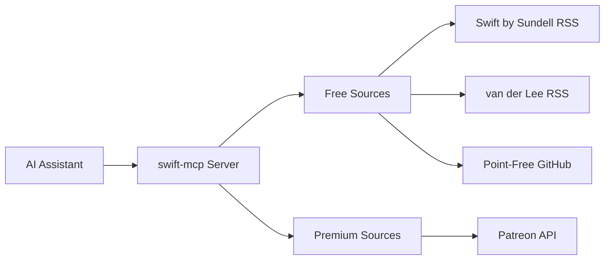

# swift-mcp

### 🎯 Curated Swift/SwiftUI Patterns from Top iOS Developers

[](https://www.npmjs.com/package/@efremidze/swift-mcp)
[](https://opensource.org/licenses/MIT)
[](https://nodejs.org)

**An MCP server providing curated Swift and SwiftUI best practices from leading iOS developers, including patterns and real-world code examples from Swift by Sundell, SwiftLee, and other trusted sources.**

[Quick Start](#-quick-start) • [Features](#-features) • [Usage](#-usage-examples) • [Contributing](#-contributing)

---

## 🎯 About

**swift-mcp** is a Model Context Protocol (MCP) server that provides your AI assistant with access to curated Swift and SwiftUI patterns, best practices, and code examples from top iOS developers and educators.

Whether you're building a new iOS app or looking for solutions to common Swift problems, swift-mcp gives your AI assistant the knowledge to provide expert-level guidance based on real-world patterns from the Swift community.

### Why swift-mcp?

- ✅ **Curated Content**: Only high-quality patterns from trusted iOS developers
- ✅ **Always Up-to-Date**: Automatically fetches the latest articles and patterns
- ✅ **MCP Native**: Works seamlessly with Claude, Cursor, Windsurf, and other MCP-compatible tools
- ✅ **Privacy First**: Free sources require no authentication
- ✅ **Extensible**: Optional Patreon integration for premium content

## 🌟 Features

### Core Features

- 🎓 **Expert Knowledge Base**: Access patterns from Swift by Sundell, Antoine van der Lee, and more
- 🔍 **Intelligent Search**: Query by topic, pattern, or specific iOS concepts
- 🎯 **Quality Filtering**: Configurable quality thresholds ensure only the best content
- 📚 **Multiple Sources**: Aggregate knowledge from various trusted educators
- 🔄 **Auto-Updates**: Content automatically refreshes from RSS feeds
- ⚡ **Fast Performance**: Efficient caching and indexed search

### Built-in Sources (Free)
- ✅ **Swift by Sundell** - Articles, patterns, and best practices
- ✅ **Antoine van der Lee** - Tutorials, tips, and deep dives
- ✅ **Point-Free** - Open source libraries and patterns

### Premium Sources (Optional)
- 🔐 **Patreon Integration** - Access premium content from creators you support

## 📋 Prerequisites

- **Node.js**: Version 18.0.0 or higher
- **MCP-Compatible AI Assistant**: Claude Desktop, Cursor, Windsurf, or VS Code with Copilot

## 🚀 Quick Start

### Install

```bash
npm install -g @efremidze/swift-mcp
```

### Configure Your AI Assistant

#### Cursor

[](https://cursor.com/en-US/install-mcp?name=swift&config=eyJjb21tYW5kIjoibnB4IC15IEBlZnJlbWlkemUvc3dpZnQtbWNwQGxhdGVzdCJ9)

Or manually add to **Cursor Settings** → **Tools** → **MCP Servers**:

`.cursor/mcp.json`:
```json
{
  "mcpServers": {
    "swift": {
      "command": "npx",
      "args": ["-y", "@efremidze/swift-mcp@latest"]
    }
  }
}
```

Alternatively, add the following to your `~/.cursor/mcp.json` file. To learn more, see the Cursor documentation.

#### Claude Code

Run this command in your terminal:

```bash
claude mcp add swift -- npx -y @efremidze/swift-mcp@latest
```

Or manually add to your project's `.mcp.json` file:

`.mcp.json`
```json
{
  "mcpServers": {
    "swift": {
      "command": "npx",
      "args": ["-y", "@efremidze/swift-mcp@latest"]
    }
  }
}
```

After adding the configuration, restart Claude Code and run /mcp to see the HeroUI MCP server in the list. If you see Connected, you're ready to use it.

See the Claude Code MCP documentation for more details.

#### Windsurf

Add the HeroUI server to your project's `.windsurf/mcp.json` configuration file:

`.windsurf/mcp.json`
```json
{
  "mcpServers": {
    "swift": {
      "command": "npx",
      "args": ["-y", "@efremidze/swift-mcp@latest"]
    }
  }
}
```

After adding the configuration, restart Windsurf to activate the MCP server.

See the Windsurf MCP documentation for more details.

#### VS Code

To configure MCP in VS Code with GitHub Copilot, add the swift-mcp server to your project's `.vscode/mcp.json` configuration file:

`.vscode/mcp.json`
```json
{
  "mcp": {
    "servers": {
      "swift": {
        "command": "npx",
        "args": ["-y", "@efremidze/swift-mcp@latest"]
      }
    }
  }
}
```

After adding the configuration, open `.vscode/mcp.json` and click Start next to the heroui-react server.

See the VS Code MCP documentation for more details.

### Test It Out

In your AI assistant, try:

```
"Show me SwiftUI animation patterns"
"What does Sundell say about testing?"
"Explain navigation patterns in SwiftUI"
```

## 🔧 Configuration

The configuration file is automatically created at `~/.swift-mcp/config.json`:

```json
{
  "sources": {
    "sundell": { "enabled": true, "quality": 60 },
    "vanderlee": { "enabled": true, "quality": 60 },
    "pointfree": { "enabled": false, "quality": 60 },
    "patreon": { "enabled": false }
  },
  "cache": {
    "ttl": 86400
  }
}
```

### Environment Variables (Optional)

For premium features, add to your MCP client config:

```json
{
  "mcpServers": {
    "swift": {
      "command": "npx",
      "args": ["-y", "@efremidze/swift-mcp@latest"],
      "env": {
        "PATREON_CLIENT_ID": "your_client_id",
        "PATREON_CLIENT_SECRET": "your_client_secret"
      }
    }
  }
}
```

## 💡 Usage Examples

### Basic Queries

```
"Show me best practices for SwiftUI animations"
"What does Sundell say about testing?"
"Explain navigation patterns in SwiftUI"
```

### Advanced Queries

```
"Show me performance tips from van der Lee"
"Find iOS architecture patterns for MVVM + coordinator"
"Give me examples for SwiftUI infinite scrolling"
```

### With Patreon Integration

```
"Show me advanced SwiftUI patterns"
"How do I build a photo editor app?"
```

## 📚 Content Sources

### Free Sources

Currently supported, no authentication needed:

| Source | Creator | Content Type | Update Frequency |
|--------|---------|--------------|------------------|
| **Swift by Sundell** | John Sundell | Articles, patterns, best practices | Weekly |
| **Antoine van der Lee** | Antoine van der Lee | Tutorials, tips, deep dives | Weekly |
| **Point-Free** | Point-Free | Open source libraries, patterns | On release |

### Premium Sources

Requires authentication and active subscriptions:

| Source | What You Get | Setup Method | Status |
|--------|--------------|--------------|--------|
| **Patreon** | Premium content from iOS creators | OAuth 2.0 | ✅ Available |

## 🔐 Premium Integration (Optional)

### Patreon Setup

Access premium content from iOS creators you support:

```bash
swift-mcp setup --patreon
```

Follow the interactive wizard to:
1. Create a Patreon OAuth application
2. Configure credentials
3. Complete authentication

📖 **Detailed Guide**: [Patreon Setup Documentation](docs/PATREON_SETUP.md)

#### Requirements

- Active Patreon account with at least one iOS creator subscription
- Patreon Creator account (free - no need to launch a creator page)
- 10 minutes for one-time OAuth setup

#### Why Creator Account?

Patreon requires OAuth apps to be registered by creators. You don't need to launch a creator page or become an active creator - just register as one to create an OAuth app for personal use.

#### What You Get

- ✅ Access to premium tutorials and patterns from creators you support
- ✅ Automatic extraction of code from downloadable content
- ✅ Quality filtering and advanced search
- ✅ Multi-creator support
- ✅ Private, secure authentication

## ⚙️ Commands

```bash
# Source management
swift-mcp source list
swift-mcp source enable <source-name>
swift-mcp source disable <source-name>

# Configuration
swift-mcp setup
swift-mcp setup --patreon

# Authentication
swift-mcp auth patreon
swift-mcp auth status
```

## 🏗️ How It Works



1. **AI Assistant Query**: Your AI assistant sends a query through the MCP protocol
2. **swift-mcp Processing**: The server searches enabled sources based on your query
3. **Content Retrieval**: Fetches and parses content from RSS feeds, APIs, and cached data
4. **Quality Filtering**: Applies configurable quality thresholds
5. **Response**: Returns formatted, relevant patterns and examples to your AI assistant

## 🔧 Troubleshooting

### Common Issues

**Node version incompatible**
```bash
node --version  # Should be >= 18.0.0
```

**Sources not returning results**
```bash
swift-mcp source list
ls ~/.swift-mcp/config.json
swift-mcp setup
```

#### Patreon Integration Issues

**OAuth redirect not working**
- Ensure redirect URI is exactly: `http://localhost:3000/patreon/callback`
- Check no other process is using port 3000
- Verify OAuth credentials are correctly set

**No premium content showing**
- Confirm you have active Patreon subscriptions to iOS creators
- Re-authenticate: `swift-mcp auth patreon`
- Check Patreon source is enabled: `swift-mcp source list`

### Getting Help

- 📖 [Full Documentation](docs/)
- 🐛 [Report Issues](https://github.com/efremidze/swift-mcp/issues)
- 💬 [Discussions](https://github.com/efremidze/swift-mcp/discussions)

## 🗺️ Roadmap

### Current (v1.x)
- [x] Core MCP server
- [x] Swift by Sundell RSS
- [x] Antoine van der Lee RSS
- [x] Patreon OAuth
- [ ] Point-Free GitHub
- [ ] Advanced filtering

### Future (v2.x)
- [ ] Additional premium sources
- [ ] More free sources
- [ ] Advanced search (with vector embeddings)
- [ ] Code validation

## 🤝 Contributing

We welcome contributions! See our [contributing guidelines](CONTRIBUTING.md).

## 📄 License

MIT License - Copyright (c) 2026 Lasha Efremidze

## 🙏 Credits

**Created by** [Lasha Efremidze](https://github.com/efremidze)

**Content Sources**
- [John Sundell](https://swiftbysundell.com) - Swift by Sundell
- [Antoine van der Lee](https://www.avanderlee.com) - SwiftLee
- [Point-Free](https://www.pointfree.co) - Advanced Swift education

**Built with** [Model Context Protocol](https://modelcontextprotocol.io)

---

**Made with ❤️ for the Swift community**

[⭐ Star this repo](https://github.com/efremidze/swift-mcp) • [🐛 Report Bug](https://github.com/efremidze/swift-mcp/issues) • [✨ Request Feature](https://github.com/efremidze/swift-mcp/issues)
