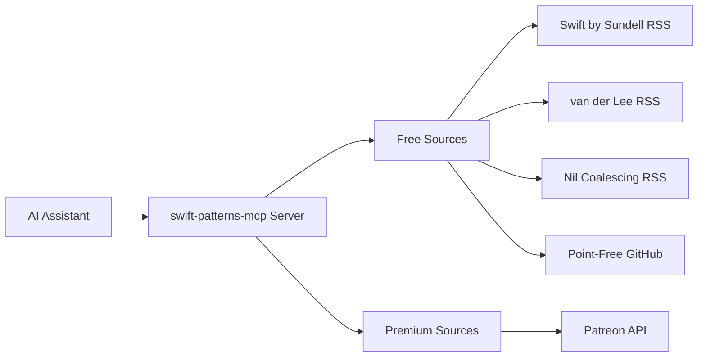

# swift-patterns-mcp

An MCP server providing curated Swift and SwiftUI best practices from leading iOS developers — with search, indexing, and optional premium integrations.

---

## Want Swift/SwiftUI best practices as an Agent Skill?

If you're mainly looking for a **lightweight, portable Swift/SwiftUI best-practices package**, use:

**swift-patterns-skill**: [https://github.com/efremidze/swift-patterns-skill](https://github.com/efremidze/swift-patterns-skill)

That repo is designed to be loaded directly as an **Agent Skill** (via `SKILL.md`) and focuses on:

* Swift + SwiftUI patterns
* architecture guidance
* decision-making frameworks
* practical do/don’t rules
* reusable references

---

## What is this repo?

**swift-patterns-mcp** is the **runtime/tooling layer**.

Use this when you want:

* 🔎 **Search + retrieval** across curated Swift/SwiftUI sources
* 🧠 **Indexing + caching** for fast, token-efficient answers
* 🌐 **Fetching external sources** (RSS / GitHub)
* 🔐 **Premium integrations** (OAuth / Patreon) *(optional)*

In short:

* **Skill repo** = best practices + guidance (portable)
* **MCP repo** = tools + fetching + premium features (runtime)

---

## Who is this for?

**swift-patterns-mcp** is for developers who want a **tooling-driven experience** for Swift/SwiftUI best practices — not just static guidance.

### Use this MCP if you want:

- 🔎 **Search across multiple sources**
  Query Swift/SwiftUI patterns from curated creators in one place.

- ⚡ **Fast, token-efficient retrieval**
  Uses indexing + caching to keep responses concise and repeatable.

- 🔄 **Always-fresh content**
  Automatically fetches and refreshes free sources like RSS feeds and GitHub repos.

- 🧩 **Runtime tooling inside an AI assistant**
  You want “tools” the agent can call (not just documentation).

- 🔐 **Premium features**
  You want authenticated / gated content via OAuth integrations (e.g. Patreon).

### This repo is especially useful for:

- iOS engineers who want **real-time lookup** during development
- interview prep when you want **quick pattern recall**
- teams standardizing SwiftUI architecture decisions
- building your own internal “Swift best practices search engine”
- agents that need **repeatable, structured answers** from trusted sources

---

## 🌟 Features

### Core Features

- 🎓 **Expert Knowledge Base**: Provides patterns from Swift by Sundell, Antoine van der Lee, Nil Coalescing, and more
- 🔍 **Intelligent Search**: Query by topic, pattern, or specific iOS concepts
- 🎯 **Quality Filtering**: Configurable quality thresholds ensure only the best content
- 📚 **Multiple Sources**: Aggregates knowledge from various trusted educators
- 🔄 **Auto-Updates**: Content automatically refreshes from RSS feeds
- ⚡ **Fast Performance**: Efficient caching and indexed search

## Sources

This MCP server can index both free and premium sources.

### Free Sources

- Swift by Sundell (RSS)
- SwiftLee (RSS)
- Nil Coalescing (RSS)
- Point-Free open-source repos on GitHub

> Note: Some sources are “free” but still benefit from MCP fetching + indexing (e.g. GitHub repos), since the MCP provides search, caching, and consistent formatting.

### Premium Sources (Optional)
- **Patreon Integration** - Access premium content from creators you support

## 📋 Prerequisites

- **Node.js**: Version 18.0.0 or higher
- **MCP-Compatible AI Assistant**: Claude Desktop, Cursor, Windsurf, or VS Code with Copilot

## 🚀 Quick Start

### Install

```bash
npm install -g swift-patterns-mcp
```

### Configure Your AI Assistant

#### Cursor

[](https://cursor.com/en-US/install-mcp?name=swift-patterns&config=eyJjb21tYW5kIjoibnB4IC15IHN3aWZ0LXBhdHRlcm5zLW1jcEBsYXRlc3QifQ%3D%3D)

Or manually add to **Cursor Settings** → **Tools** → **MCP Servers**:

`.cursor/mcp.json`:
```json
{
  "mcpServers": {
    "swift-patterns": {
      "command": "npx",
      "args": ["-y", "swift-patterns-mcp@latest"]
    }
  }
}
```

Alternatively, add the following to your `~/.cursor/mcp.json` file. To learn more, see the Cursor documentation.

#### Claude Code

Run this command in your terminal:

```bash
claude mcp add swift-patterns -- npx -y swift-patterns-mcp@latest
```

Or manually add to your project's `.mcp.json` file:

`.mcp.json`
```json
{
  "mcpServers": {
    "swift-patterns": {
      "command": "npx",
      "args": ["-y", "swift-patterns-mcp@latest"]
    }
  }
}
```

After adding the configuration, restart Claude Code and run /mcp to see the swift-patterns MCP server in the list. If you see Connected, you're ready to use it.

See the Claude Code MCP documentation for more details.

#### Windsurf

Add the swift-patterns server to your project's `.windsurf/mcp.json` configuration file:

`.windsurf/mcp.json`
```json
{
  "mcpServers": {
    "swift-patterns": {
      "command": "npx",
      "args": ["-y", "swift-patterns-mcp@latest"]
    }
  }
}
```

After adding the configuration, restart Windsurf to activate the MCP server.

See the Windsurf MCP documentation for more details.

#### VS Code

To configure MCP in VS Code with GitHub Copilot, add the swift-patterns-mcp server to your project's `.vscode/mcp.json` configuration file:

`.vscode/mcp.json`
```json
{
  "mcp": {
    "servers": {
      "swift-patterns": {
        "command": "npx",
        "args": ["-y", "swift-patterns-mcp@latest"]
      }
    }
  }
}
```

After adding the configuration, open `.vscode/mcp.json` and click Start next to the swift-patterns server.

See the VS Code MCP documentation for more details.

### Test It Out

Try these queries:

```
"Show me SwiftUI animation patterns"
"What does Sundell say about testing?"
"Explain navigation patterns in SwiftUI"
```

## 🔧 Configuration

The configuration file is automatically created at `~/.swift-patterns-mcp/config.json`:

```json
{
  "sources": {
    "sundell": { "enabled": true, "configured": true },
    "vanderlee": { "enabled": true, "configured": true },
    "nilcoalescing": { "enabled": true, "configured": true },
    "pointfree": { "enabled": true, "configured": true },
    "patreon": { "enabled": false, "configured": false }
  },
  "prefetchSources": true,
  "semanticRecall": {
    "enabled": false,
    "minLexicalScore": 0.35,
    "minRelevanceScore": 70
  },
  "memvid": {
    "enabled": true,
    "autoStore": true,
    "useEmbeddings": false,
    "embeddingModel": "bge-small"
  }
}
```

### Persistent Memory with Memvid (Enhanced Recall)

Memvid provides persistent semantic memory that improves recall across sessions and evolving sources. Unlike in-memory caching, memvid stores patterns in a single-file database that persists between server restarts.

**Features:**
- 💾 **Persistent Storage**: Patterns are stored in `~/.swift-patterns-mcp/swift-patterns-memory.mv2`
- 🔍 **Cross-Session Recall**: Find patterns from previous searches even after server restart
- 🧠 **Semantic Search**: Optional embedding-based similarity search
- 🚀 **Automatic Storage**: Patterns are automatically stored during searches
- ⚡ **Fast Retrieval**: Built-in BM25 + optional vector search

**Configuration:**

```json
{
  "memvid": {
    "enabled": true,              // Enable memvid persistent memory
    "autoStore": true,            // Automatically store patterns during searches
    "useEmbeddings": false,       // Use semantic embeddings (requires model download)
    "embeddingModel": "bge-small" // Embedding model: "bge-small", "openai-small"
  }
}
```

**When to Enable:**
- You want patterns to persist across server restarts
- You frequently search for similar topics
- You want improved recall for evolving source content
- You need cross-session semantic memory

**Note:** Memvid complements MiniSearch (for fast in-session search) and semantic recall (for in-session fallback). All three work together:
1. MiniSearch handles fast lexical search within current session
2. Semantic recall activates for poor lexical results (in-session)
3. Memvid provides cross-session persistent memory and recall

### Semantic Recall (Optional AI Enhancement)

Semantic recall provides AI-powered semantic search as a fallback when traditional keyword search returns poor results. It uses transformer embeddings to understand query intent and find conceptually similar patterns.

**Features:**
- 🧠 Automatically activates when keyword search scores are low
- 🎯 Uses sentence transformers to understand meaning, not just keywords
- 📊 Quality filtering to only index high-relevance patterns
- ⚡ Efficient caching of embeddings

**Configuration:**

```json
{
  "semanticRecall": {
    "enabled": false,              // Enable semantic recall
    "minLexicalScore": 0.35,       // Activate when keyword search < 0.35
    "minRelevanceScore": 70        // Only index patterns with score >= 70
  }
}
```

**When to Enable:**
- Your queries use conceptual terms that don't match exact keywords
- You want more intelligent, context-aware search results
- You're okay with slightly slower first-time searches (embeddings need to compute)

**Note:** Requires downloading a ~50MB transformer model on first use. Embeddings are cached for performance.

### Environment Variables (Optional)

For premium features, add to your MCP client config:

```json
{
  "mcpServers": {
    "swift-patterns": {
      "command": "npx",
      "args": ["-y", "swift-patterns-mcp@latest"],
      "env": {
        "PATREON_CLIENT_ID": "your_client_id",
        "PATREON_CLIENT_SECRET": "your_client_secret"
      }
    }
  }
}
```

## 💡 Usage Examples

### Basic Queries

```
"Show me best practices for SwiftUI animations"
"What does Sundell say about testing?"
"Explain navigation patterns in SwiftUI"
```

### Advanced Queries

```
"Show me performance tips from van der Lee"
"Find iOS architecture patterns for MVVM + coordinator"
"Give me examples for SwiftUI infinite scrolling"
```

### With Patreon Integration

```
"Show me advanced SwiftUI patterns"
"How do I build a photo editor app?"
```

## 📚 Content Sources

### Free Sources

Currently supported, no authentication needed:

| Source | Creator | Content Type | Update Frequency |
|--------|---------|--------------|------------------|
| **Swift by Sundell** | John Sundell | Articles, patterns, best practices | Weekly |
| **Antoine van der Lee** | Antoine van der Lee | Tutorials, tips, deep dives | Weekly |
| **Nil Coalescing** | Nil Coalescing | SwiftUI patterns, Swift tips | Weekly |
| **Point-Free** | Point-Free | Open source libraries, patterns | On release |

### Premium Sources

Requires authentication and active subscriptions:

| Source | What You Get | Setup Method | Status |
|--------|--------------|--------------|--------|
| **Patreon** | Premium content from iOS creators | OAuth 2.0 | ✅ Available |

## 🔐 Premium Integration (Optional)

### Patreon Setup

Access premium content from iOS creators you support:

```bash
swift-patterns-mcp setup --patreon
```

Follow the interactive wizard to:
1. Create a Patreon OAuth application
2. Configure credentials
3. Complete authentication

📖 **Detailed Guide**: [Patreon Setup Documentation](docs/PATREON_SETUP.md)

#### Requirements

- Active Patreon account with at least one iOS creator subscription
- Patreon Creator account (free - no need to launch a creator page)
- 10 minutes for one-time OAuth setup

#### Why Creator Account?

Patreon requires OAuth apps to be registered by creators. You don't need to launch a creator page or become an active creator - just register as one to create an OAuth app for personal use.

#### What You Get

- ✅ Access to premium tutorials and patterns from creators you support
- ✅ Automatic extraction of code from downloadable content
- ✅ Quality filtering and advanced search
- ✅ Multi-creator support
- ✅ Private, secure authentication

## ⚙️ Commands

```bash
# Source management
swift-patterns-mcp source list
swift-patterns-mcp source enable <source-name>
swift-patterns-mcp source disable <source-name>

# Configuration
swift-patterns-mcp setup
swift-patterns-mcp setup --patreon

# Authentication
swift-patterns-mcp auth patreon
swift-patterns-mcp auth status
```

## 🏗️ How It Works



1. **Query**: Receives a query through the MCP protocol
2. **Processing**: Searches enabled sources based on the query
3. **Content Retrieval**: Fetches and parses content from RSS feeds, APIs, and cached data
4. **Quality Filtering**: Applies configurable quality thresholds
5. **Response**: Returns formatted, relevant patterns and examples

## 🔧 Troubleshooting

### Common Issues

**Node version incompatible**
```bash
node --version  # Should be >= 18.0.0
```

**Sources not returning results**
```bash
swift-patterns-mcp source list
ls ~/.swift-patterns-mcp/config.json
swift-patterns-mcp setup
```

#### Patreon Integration Issues

**OAuth redirect not working**
- Ensure redirect URI is exactly: `http://localhost:3000/patreon/callback`
- Check no other process is using port 3000
- Verify OAuth credentials are correctly set

**No premium content showing**
- Confirm you have active Patreon subscriptions to iOS creators
- Re-authenticate: `swift-patterns-mcp auth patreon`
- Check Patreon source is enabled: `swift-patterns-mcp source list`

## 🗺️ Roadmap

### Current (v1.x)
- [x] Core MCP server
- [x] Swift by Sundell RSS
- [x] Antoine van der Lee RSS
- [x] Nil Coalescing RSS
- [x] Patreon OAuth
- [x] Point-Free GitHub
- [ ] Advanced filtering

### Future (v2.x)
- [ ] Additional premium sources
- [ ] More free sources
- [ ] Code validation

## 🤝 Contributing

We welcome contributions! See our [contributing guidelines](CONTRIBUTING.md).

## 📄 License

MIT License - Copyright (c) 2026 Lasha Efremidze

## 🙏 Credits

**Created by** [Lasha Efremidze](https://github.com/efremidze)

**Content Sources**
- [John Sundell](https://swiftbysundell.com) - Swift by Sundell
- [Antoine van der Lee](https://www.avanderlee.com) - SwiftLee
- [Nil Coalescing](https://nilcoalescing.com) - SwiftUI patterns and Swift tips
- [Point-Free](https://www.pointfree.co) - Advanced Swift education

**Built with** [Model Context Protocol](https://modelcontextprotocol.io)

---

**Made with ❤️ for the Swift community**

[⭐ Star this repo](https://github.com/efremidze/swift-patterns-mcp) • [🐛 Report Bug](./issues) • [✨ Request Feature](./issues)
