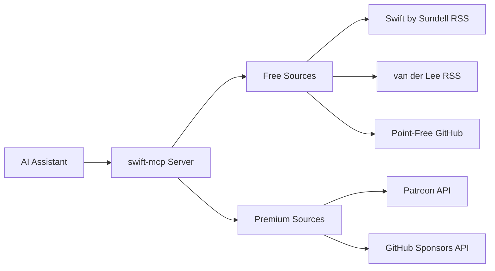

<div align="center">

# swift-mcp

### 🎯 Curated Swift/SwiftUI Patterns from Top iOS Developers

[](https://www.npmjs.com/package/@efremidze/swift-mcp)
[](https://opensource.org/licenses/MIT)
[](https://nodejs.org)

**An MCP server that brings best practices from leading iOS developers directly to your AI assistant.**

[Quick Start](#-quick-start) • [Features](#-features) • [Documentation](#-documentation) • [Examples](#-usage-examples) • [Contributing](#-contributing)

</div>

---

## 📖 Table of Contents

- [About](#-about)
- [Features](#-features)
- [Prerequisites](#-prerequisites)
- [Quick Start](#-quick-start)
- [Installation](#-installation)
- [Configuration](#-configuration)
- [Usage Examples](#-usage-examples)
- [Content Sources](#-content-sources)
- [Premium Integration](#-premium-integration-optional)
- [Commands](#-commands)
- [How It Works](#-how-it-works)
- [Troubleshooting](#-troubleshooting)
- [Documentation](#-documentation)
- [Roadmap](#-roadmap)
- [Contributing](#-contributing)
- [License](#-license)
- [Credits](#-credits)

## 🎯 About

**swift-mcp** is a Model Context Protocol (MCP) server that provides your AI assistant with access to curated Swift and SwiftUI patterns, best practices, and code examples from top iOS developers and educators.

Whether you're building a new iOS app or looking for solutions to common Swift problems, swift-mcp gives your AI assistant the knowledge to provide expert-level guidance based on real-world patterns from the Swift community.

### Why swift-mcp?

- ✅ **Curated Content**: Only high-quality patterns from trusted iOS developers
- ✅ **Always Up-to-Date**: Automatically fetches the latest articles and patterns
- ✅ **MCP Native**: Works seamlessly with Claude, Cursor, Windsurf, and other MCP-compatible tools
- ✅ **Privacy First**: Free sources require no authentication
- ✅ **Extensible**: Optional Patreon integration for premium content you already support

## 🌟 Features

### Core Features

- 🎓 **Expert Knowledge Base**: Access patterns from Swift by Sundell, Antoine van der Lee, and more
- 🔍 **Intelligent Search**: Query by topic, pattern, or specific iOS concepts
- 🎯 **Quality Filtering**: Configurable quality thresholds ensure only the best content
- 📚 **Multiple Sources**: Aggregate knowledge from various trusted educators
- 🔄 **Auto-Updates**: Content automatically refreshes from RSS feeds
- ⚡ **Fast Performance**: Efficient caching and indexed search

### Built-in Sources (Free)

- ✅ **Swift by Sundell** - Articles, patterns, and best practices
- ✅ **Antoine van der Lee** - Tutorials, tips, and deep dives
- ✅ **Point-Free** - Open source libraries and patterns

### Premium Sources (Optional)

- 🔐 **Patreon Integration** - Access premium content from creators you support
- 🚀 **GitHub Sponsors** *(Coming Soon)* - Support open source and get exclusive patterns

## 📋 Prerequisites

Before installing swift-mcp, ensure you have:

- **Node.js**: Version 18.0.0 or higher ([Download](https://nodejs.org))
- **npm**: Comes with Node.js
- **MCP-Compatible AI Assistant**: Such as:
  - [Claude Desktop](https://claude.ai/desktop)
  - [Cursor](https://cursor.sh)
  - [Windsurf](https://codeium.com/windsurf)
  - Any tool supporting the [Model Context Protocol](https://modelcontextprotocol.io)

## 🚀 Quick Start

Get started in less than 2 minutes:

```bash
# Install globally
npm install -g @efremidze/swift-mcp

# That's it! Free sources work immediately with no configuration needed
```

### Test It Out

In your AI assistant (Cursor, Claude, etc.), try:

```
"Show me SwiftUI animation patterns"
```

You'll get curated patterns from Swift by Sundell, Antoine van der Lee, and other top sources!

## 📦 Installation

### Global Installation (Recommended)

```bash
npm install -g @efremidze/swift-mcp
```

### Configure Your AI Assistant

#### Cursor

Create or edit `.cursor/mcp.json`:

```json
{
  "mcpServers": {
    "swift": {
      "command": "npx",
      "args": ["-y", "@efremidze/swift-mcp@latest"]
    }
  }
}
```

#### Claude Desktop

Add to `~/Library/Application Support/Claude/claude_desktop_config.json` (macOS):

```json
{
  "mcpServers": {
    "swift": {
      "command": "npx",
      "args": ["-y", "@efremidze/swift-mcp@latest"]
    }
  }
}
```

#### Windsurf

Create or edit `.windsurf/mcp.json`:

```json
{
  "mcpServers": {
    "swift": {
      "command": "npx",
      "args": ["-y", "@efremidze/swift-mcp@latest"]
    }
  }
}
```

### Verify Installation

```bash
swift-mcp --version
```

## 🔧 Configuration

### Configuration File

The configuration file is automatically created at `~/.swift-mcp/config.json`:

```json
{
  "sources": {
    "sundell": { 
      "enabled": true,
      "quality": 60
    },
    "vanderlee": { 
      "enabled": true,
      "quality": 60
    },
    "pointfree": { 
      "enabled": true,
      "quality": 60
    },
    "patreon": { 
      "enabled": false
    }
  },
  "cache": {
    "ttl": 86400
  }
}
```

### Configuration Options

| Option | Type | Default | Description |
|--------|------|---------|-------------|
| `enabled` | boolean | `true` | Enable/disable a source |
| `quality` | number | `60` | Minimum quality score (0-100) |
| `cache.ttl` | number | `86400` | Cache time-to-live in seconds |

## 💡 Usage Examples

Once installed, ask your AI assistant natural questions:

### Basic Queries

```
"Show me SwiftUI animation patterns"
→ Returns curated animation patterns from all free sources

"What does Sundell say about testing?"
→ Returns testing-related content specifically from Swift by Sundell

"Find async/await examples with code"
→ Returns articles with practical async/await code examples
```

### Advanced Queries

```
"Show me performance tips from van der Lee"
→ Filters to Antoine van der Lee's performance-related content

"Get iOS architecture patterns"
→ Returns architecture and design pattern articles

"Find Combine framework examples"
→ Returns Combine-related tutorials and patterns
```

### With Patreon Integration

```
"Show me advanced SwiftUI patterns from my Patreon"
→ Returns premium content from creators you support + free sources

"Get the latest content from creators I support"
→ Accesses your Patreon subscriptions for exclusive content
```

## 📚 Content Sources

### Free Sources

Always enabled, no authentication needed:

| Source | Creator | Content Type | Update Frequency |
|--------|---------|--------------|------------------|
| **Swift by Sundell** | John Sundell | Articles, patterns, best practices | Weekly |
| **Antoine van der Lee** | Antoine van der Lee | Tutorials, tips, deep dives | Weekly |
| **Point-Free** | Point-Free | Open source libraries, patterns | On release |

### Premium Sources

Requires authentication and active subscriptions:

| Source | What You Get | Setup Method | Status |
|--------|--------------|--------------|--------|
| **Patreon** | Premium content from iOS creators | OAuth 2.0 | ✅ Available |
| **GitHub Sponsors** | Exclusive patterns from sponsored devs | OAuth 2.0 | 🚧 Coming Soon |

## 🔐 Premium Integration (Optional)

### Patreon Integration

Unlock premium content from iOS creators you already support on Patreon.

#### Requirements

- Active Patreon account with at least one iOS creator subscription
- Patreon Creator account (free - no need to launch a creator page)
- 10 minutes for one-time OAuth setup

#### Why Creator Account?

Patreon requires OAuth apps to be registered by creators. You don't need to launch a creator page or become an active creator - just register as one to create an OAuth app for personal use.

#### Setup Steps

1. **Start the setup wizard:**
   ```bash
   swift-mcp setup --patreon
   ```

2. **Follow the interactive prompts** to:
   - Create a Patreon OAuth application
   - Set up redirect URIs
   - Configure credentials

3. **Complete OAuth authentication** in your browser

4. **Start using premium content** immediately!

#### What You Get

- ✅ Access to premium tutorials and patterns from creators you support
- ✅ Automatic extraction of code from downloadable content
- ✅ Quality filtering and advanced search
- ✅ Multi-creator support
- ✅ Private, secure authentication

📖 **Detailed Guide**: [Patreon Setup Documentation](docs/PATREON_SETUP.md)

## ⚙️ Commands

### Source Management

```bash
# List all available sources and their status
swift-mcp source list

# Enable a source
swift-mcp source enable <source-name>

# Disable a source
swift-mcp source disable <source-name>

# Examples
swift-mcp source enable patreon
swift-mcp source disable pointfree
```

### Configuration

```bash
# Run initial setup (creates config file)
swift-mcp setup

# Set up Patreon integration
swift-mcp setup --patreon

# View current configuration
cat ~/.swift-mcp/config.json
```

### Authentication

```bash
# Authenticate with Patreon
swift-mcp auth patreon

# Check authentication status
swift-mcp auth status
```

## 🏗️ How It Works



1. **AI Assistant Query**: Your AI assistant sends a query through the MCP protocol
2. **swift-mcp Processing**: The server searches enabled sources based on your query
3. **Content Retrieval**: Fetches and parses content from RSS feeds, APIs, and cached data
4. **Quality Filtering**: Applies configurable quality thresholds
5. **Response**: Returns formatted, relevant patterns and examples to your AI assistant

## 🔧 Troubleshooting

### Common Issues

#### Installation Problems

**Error: Node version incompatible**
```bash
# Check your Node version
node --version

# Should be >= 18.0.0
# Update Node if needed: https://nodejs.org
```

**Error: Permission denied during global install**
```bash
# Use npx without global install
npx @efremidze/swift-mcp@latest

# Or fix npm permissions:
# https://docs.npmjs.com/resolving-eacces-permissions-errors
```

#### Configuration Issues

**Sources not returning results**
```bash
# Verify sources are enabled
swift-mcp source list

# Check configuration file exists
ls ~/.swift-mcp/config.json

# Re-run setup if needed
swift-mcp setup
```

#### Patreon Integration Issues

**OAuth redirect not working**
- Ensure redirect URI is exactly: `http://localhost:3000/patreon/callback`
- Check no other process is using port 3000
- Verify OAuth credentials are correctly set

**No premium content showing**
- Confirm you have active Patreon subscriptions to iOS creators
- Re-authenticate: `swift-mcp auth patreon`
- Check Patreon source is enabled: `swift-mcp source list`

### Getting Help

- 📖 [Full Documentation](docs/)
- 🐛 [Report Issues](https://github.com/efremidze/swift-mcp/issues)
- 💬 [Discussions](https://github.com/efremidze/swift-mcp/discussions)

## 📚 Documentation

- [Quick Start Guide](QUICKSTART.md) - Get started in 2 minutes
- [Patreon Setup Guide](docs/PATREON_SETUP.md) - Detailed Patreon integration instructions
- [Project Structure](docs/STRUCTURE.md) - Technical architecture and codebase overview

## 🗺️ Roadmap

### Current Focus (v1.x)

- [x] Core MCP server implementation
- [x] Swift by Sundell RSS integration
- [x] Antoine van der Lee RSS integration
- [x] Basic source management
- [x] Patreon OAuth integration
- [ ] Point-Free GitHub integration
- [ ] Advanced quality filtering
- [ ] Code extraction from articles

### Future Plans (v2.x)

- [ ] GitHub Sponsors integration
- [ ] YouTube transcript extraction
- [ ] Conference talk indexing
- [ ] Multi-language support
- [ ] Local content caching improvements
- [ ] Advanced search with vector embeddings
- [ ] Custom source plugins

### Long-term Vision

- [ ] Community-contributed sources
- [ ] Pattern recommendation engine
- [ ] Code snippet validation
- [ ] Integration with Xcode
- [ ] Swift package ecosystem integration

## 🤝 Contributing

We welcome contributions! Whether it's bug reports, feature requests, or code contributions, we appreciate your help.

### How to Contribute

1. **Fork the repository**
2. **Create a feature branch**: `git checkout -b feature/amazing-feature`
3. **Commit your changes**: `git commit -m 'Add amazing feature'`
4. **Push to the branch**: `git push origin feature/amazing-feature`
5. **Open a Pull Request**

### Development Setup

```bash
# Clone your fork
git clone https://github.com/YOUR_USERNAME/swift-mcp.git
cd swift-mcp

# Install dependencies
npm install

# Build the project
npm run build

# Run in development mode
npm run watch
```

### Areas We Need Help

- 🐛 Bug fixes and testing
- 📝 Documentation improvements
- 🎨 Adding new content sources
- 🌍 Internationalization
- ⚡ Performance optimization

### Code of Conduct

Please be respectful and constructive. We're here to build something great together!

## 📄 License

This project is licensed under the **MIT License** - see the [LICENSE](LICENSE) file for details.

```
MIT License - Copyright (c) 2024 Lasha Efremidze
```

## 🙏 Credits

### Created By

**Lasha Efremidze** - [GitHub](https://github.com/efremidze)

### Built With

- [Model Context Protocol](https://modelcontextprotocol.io) - The protocol enabling AI-to-tool communication
- [TypeScript](https://www.typescriptlang.org) - Language and tooling
- [rss-parser](https://github.com/rbren/rss-parser) - RSS feed parsing
- [Patreon API](https://www.patreon.com/platform/documentation/api) - Premium content integration

### Content Sources

Special thanks to the iOS developers and educators whose content makes this possible:

- 🌟 [John Sundell](https://swiftbysundell.com) - Swift by Sundell
- 🌟 [Antoine van der Lee](https://www.avanderlee.com) - SwiftLee
- 🌟 [Point-Free](https://www.pointfree.co) - Advanced Swift education

### Inspiration

This project was inspired by the need to bring expert iOS knowledge directly into AI-assisted development workflows.

---

<div align="center">

**Made with ❤️ for the Swift community**

[⭐ Star this repo](https://github.com/efremidze/swift-mcp) • [🐛 Report Bug](https://github.com/efremidze/swift-mcp/issues) • [✨ Request Feature](https://github.com/efremidze/swift-mcp/issues)

</div>
