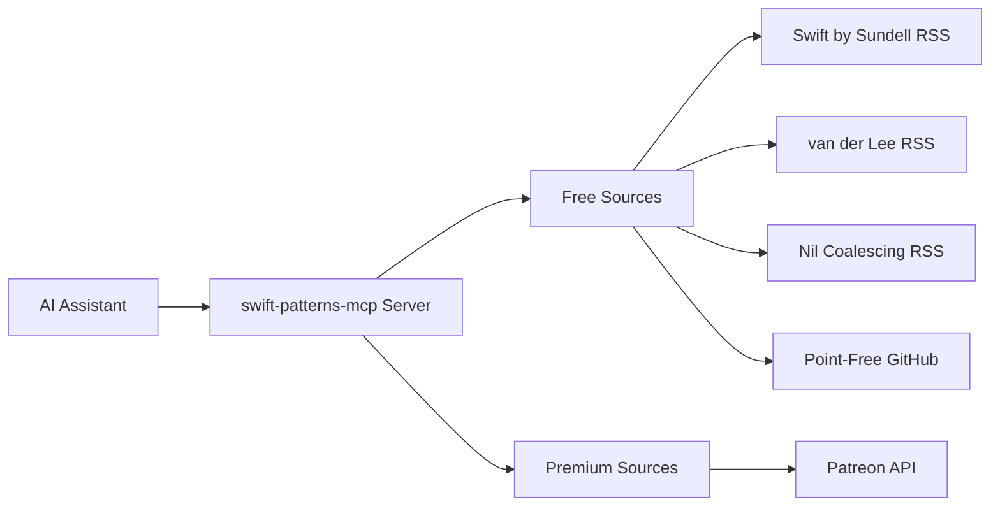

# swift-patterns-mcp

An MCP server providing curated Swift and SwiftUI best practices from leading iOS developers — with intelligent search, persistent memory, and optional premium integrations.

## Want an Agent Skill?

If you want a **lightweight, portable Swift/SwiftUI best-practices package** without runtime tooling, check out:

**[swift-patterns-skill](https://github.com/efremidze/swift-patterns-skill)**: Designed as a portable Agent Skill focused on Swift/SwiftUI patterns, architecture guidance, and decision-making frameworks.

**Key difference:**
- **swift-patterns-skill** = Static guidance (portable, no runtime)
- **swift-patterns-mcp** = Dynamic tooling (search, retrieval, premium features)

**Note:** This repo is an MCP server only. It does **not** ship an Agent Skill (`SKILL.md`) or skill references.

## What does this MCP provide?

**swift-patterns-mcp** delivers runtime tools for accessing Swift/SwiftUI best practices:

- 🔎 **Search & retrieval** across curated sources
- 🧠 **Persistent memory** with cross-session recall
- 🔄 **Auto-refreshing content** from RSS feeds and GitHub
- 🎯 **Intelligent filtering** by quality and relevance
- 🔐 **Premium integrations** (optional Patreon support)

### Ideal for:

- **Active Development**: "How do I implement pull-to-refresh in SwiftUI?" answered instantly without leaving your IDE
- **Architecture Decisions**: Compare MVVM vs. TCA patterns with concrete examples from trusted sources
- **Staying Current**: Access the latest patterns and best practices as they're published by leading iOS developers
- **Team Standards**: Build a searchable reference of approved patterns for your organization
- **AI-Powered Workflows**: Enable agents to query "Show me Sundell's approach to dependency injection" with consistent, quality responses

## 🌟 Features

- 🎓 **Expert Knowledge Base**: Patterns from Swift by Sundell, Antoine van der Lee, Nil Coalescing, and more
- 🔍 **Intelligent Search**: Query by topic, pattern, or specific iOS concept
- 💾 **Persistent Memory**: Cross-session recall with Memvid storage
- 🧠 **Semantic Search**: Optional AI-powered fallback for better conceptual matches
- 📚 **Multiple Sources**: Aggregates knowledge from trusted educators
- 🔄 **Auto-Updates**: Content refreshes automatically from RSS feeds
- ⚡ **Fast Performance**: Efficient caching and indexed search

## Content Sources

### Free Sources

These sources are publicly available but benefit from MCP's fetching, caching, and search capabilities:

| Source | Content Type | Updates |
|--------|--------------|---------|
| **Swift by Sundell** | Articles, patterns, best practices | Weekly |
| **SwiftLee** | Tutorials, tips, deep dives | Weekly |
| **Nil Coalescing** | SwiftUI patterns, Swift tips | Weekly |
| **Point-Free** | Open-source libraries, patterns | On release |

### Premium Sources

Premium content requires OAuth authentication and active subscriptions:

| Source | What You Get | Authentication |
|--------|--------------|-------|
| **Patreon** | Premium content from supported creators | OAuth 2.0 |


## 📋 Prerequisites

- **Node.js** 18.0.0 or higher
- **MCP-Compatible AI Assistant**: Claude Desktop, Cursor, Windsurf, VS Code with Copilot, or Claude Code

## 🚀 Quick Start

### Install

```bash
npm install -g swift-patterns-mcp
```

### Configure Your AI Assistant

#### Cursor

[](https://cursor.com/en-US/install-mcp?name=swift-patterns&config=eyJjb21tYW5kIjoibnB4IC15IHN3aWZ0LXBhdHRlcm5zLW1jcEBsYXRlc3QifQ%3D%3D)

Or manually add to **Cursor Settings** → **Tools** → **MCP Servers**:

`.cursor/mcp.json`:
```json
{
  "mcpServers": {
    "swift-patterns": {
      "command": "npx",
      "args": ["-y", "swift-patterns-mcp@latest"]
    }
  }
}
```

Alternatively, add to `~/.cursor/mcp.json`. See [Cursor documentation](https://docs.cursor.com) for details.

#### Claude Code

Run in your terminal:

```bash
claude mcp add swift-patterns -- npx -y swift-patterns-mcp@latest
```

Or manually add to `.mcp.json`:

```json
{
  "mcpServers": {
    "swift-patterns": {
      "command": "npx",
      "args": ["-y", "swift-patterns-mcp@latest"]
    }
  }
}
```

Restart Claude Code and run `/mcp` to verify. See [Claude Code MCP documentation](https://docs.claude.ai/claude-code) for details.

#### Windsurf

Add to `.windsurf/mcp.json`:

```json
{
  "mcpServers": {
    "swift-patterns": {
      "command": "npx",
      "args": ["-y", "swift-patterns-mcp@latest"]
    }
  }
}
```

Restart Windsurf to activate. See [Windsurf MCP documentation](https://docs.windsurf.com) for details.

#### VS Code

Add to `.vscode/mcp.json`:

```json
{
  "mcp": {
    "servers": {
      "swift-patterns": {
        "command": "npx",
        "args": ["-y", "swift-patterns-mcp@latest"]
      }
    }
  }
}
```

Open `.vscode/mcp.json` and click **Start** next to the swift-patterns server. See [VS Code MCP documentation](https://code.visualstudio.com/docs/copilot/mcp) for details.

### Test It Out

Try these queries:

```
"Show me SwiftUI animation patterns"
"What does Sundell say about testing?"
"Explain navigation patterns in SwiftUI"
```

## 🔧 Configuration

Configuration is automatically created at `~/.swift-patterns-mcp/config.json`:

```json
{
  "sources": {
    "sundell": { "enabled": true, "configured": true },
    "vanderlee": { "enabled": true, "configured": true },
    "nilcoalescing": { "enabled": true, "configured": true },
    "pointfree": { "enabled": true, "configured": true },
    "patreon": { "enabled": false, "configured": false }
  },
  "prefetchSources": true,
  "semanticRecall": {
    "enabled": false,
    "minLexicalScore": 0.35,
    "minRelevanceScore": 70
  },
  "memvid": {
    "enabled": true,
    "autoStore": true,
    "useEmbeddings": false,
    "embeddingModel": "bge-small"
  }
}
```

### Persistent Memory with Memvid

Memvid provides persistent semantic memory that improves recall across sessions. Unlike in-memory caching, Memvid stores patterns in a single-file database that persists between server restarts.

**Features:**
- 💾 **Persistent Storage**: Patterns stored in `~/.swift-patterns-mcp/swift-patterns-memory.mv2`
- 🔁 **Cross-Session Recall**: Find patterns from previous searches after server restart
- 🧠 **Semantic Search**: Optional embedding-based similarity search
- 🚀 **Automatic Storage**: Patterns stored during searches
- ⚡ **Fast Retrieval**: Built-in BM25 + optional vector search

**Configuration:**

```json
{
  "memvid": {
    "enabled": true,              // Enable Memvid persistent memory
    "autoStore": true,            // Automatically store patterns during searches
    "useEmbeddings": false,       // Use semantic embeddings (requires model download)
    "embeddingModel": "bge-small" // Options: "bge-small", "openai-small"
  }
}
```

**When to enable:**
- You want patterns to persist across server restarts
- You frequently search for similar topics
- You need cross-session semantic memory

**Note:** Memvid complements MiniSearch (fast in-session search) and semantic recall (in-session fallback). All three work together:
1. **MiniSearch**: Fast lexical search within current session
2. **Semantic recall**: Activates for poor lexical results (in-session)
3. **Memvid**: Cross-session persistent memory and recall

### Semantic Recall (Optional AI Enhancement)

Semantic recall provides AI-powered semantic search as a fallback when keyword search returns poor results. It uses transformer embeddings to understand query intent and find conceptually similar patterns.

**Features:**
- 🧠 Automatically activates when keyword search scores are low
- 🎯 Uses sentence transformers to understand meaning beyond keywords
- 📊 Quality filtering to index only high-relevance patterns
- ⚡ Efficient embedding caching

**Configuration:**

```json
{
  "semanticRecall": {
    "enabled": false,              // Enable semantic recall
    "minLexicalScore": 0.35,       // Activate when keyword search < 0.35
    "minRelevanceScore": 70        // Only index patterns with score >= 70
  }
}
```

**When to enable:**
- Your queries use conceptual terms that don't match exact keywords
- You want more intelligent, context-aware search results
- You're okay with slightly slower first-time searches (embeddings need to compute)

**Note:** Requires downloading a ~50MB transformer model on first use. Embeddings are cached for performance.

### Environment Variables (Optional)

For premium features, add to your MCP client config:

```json
{
  "mcpServers": {
    "swift-patterns": {
      "command": "npx",
      "args": ["-y", "swift-patterns-mcp@latest"],
      "env": {
        "PATREON_CLIENT_ID": "your_client_id",
        "PATREON_CLIENT_SECRET": "your_client_secret"
      }
    }
  }
}
```

## 💡 Usage Examples

### Basic Queries

```
"How can I use lazy var in @Observable classes?"
"Show me modern SwiftUI animation best practices using symbolEffect (with button + state examples)"
"Explain common SwiftUI navigation patterns (NavigationStack, NavigationPath, enum routing) and when to use each"
```

### Advanced Queries

```
"Build a coordinator-style architecture for SwiftUI: MVVM + dependency injection + type-safe routing"
"Give me a clean infinite scrolling implementation: pagination, dedupe, cancellation, and loading states"
"Explain how @Observable improves SwiftUI performance vs ObservableObject, then refactor my view model to @Observable"
```

### With Patreon Integration

```
"Build a SwiftUI parallax + sticky header screen like a profile page (include reusable component version)"
"Show me how to build a photo editor flow: PhotosPicker -> crop -> filters -> export/share"
"Give me 5 advanced SwiftUI micro-interactions (toasts, sheets, draggable cards, haptics) with production-ready code"
```

## 🔐 Premium Integration (Optional)

### Patreon Setup

Access premium content from iOS creators you support:

```bash
swift-patterns-mcp setup --patreon
```

Follow the interactive wizard to:
1. Create a Patreon OAuth application
2. Configure credentials
3. Complete authentication

📖 **Detailed Guide**: [Patreon Setup Documentation](docs/PATREON_SETUP.md)

#### Requirements

- Active Patreon account with at least one iOS creator subscription
- Patreon Creator account (free - no need to launch a creator page)
- 10 minutes for one-time OAuth setup

#### Why Creator Account?

Patreon requires OAuth apps to be registered by creators. You don't need to launch a creator page or become an active creator - just register as one to create an OAuth app for personal use.

#### What You Get

- ✅ Access to premium tutorials and patterns from creators you support
- ✅ Automatic extraction of code from downloadable content
- ✅ Quality filtering and advanced search
- ✅ Multi-creator support
- ✅ Private, secure authentication

## ⚙️ Commands

```bash
# Source management
swift-patterns-mcp source list
swift-patterns-mcp source enable <source-name>
swift-patterns-mcp source disable <source-name>

# Configuration
swift-patterns-mcp setup
swift-patterns-mcp setup --patreon

# Authentication
swift-patterns-mcp auth patreon
swift-patterns-mcp auth status
```

## 🗃️ How It Works



1. **Query**: Receives a query through the MCP protocol
2. **Processing**: Searches enabled sources based on the query
3. **Content Retrieval**: Fetches and parses content from RSS feeds, APIs, and cached data
4. **Quality Filtering**: Applies configurable quality thresholds
5. **Response**: Returns formatted, relevant patterns and examples

## 🔧 Troubleshooting

### Common Issues

**Node version incompatible**
```bash
node --version  # Should be >= 18.0.0
```

**Sources not returning results**
```bash
swift-patterns-mcp source list
ls ~/.swift-patterns-mcp/config.json
swift-patterns-mcp setup
```

### Patreon Integration Issues

**OAuth redirect not working**
- Ensure redirect URI is exactly: `http://localhost:3000/patreon/callback`
- Check no other process is using port 3000
- Verify OAuth credentials are correctly set

**No premium content showing**
- Confirm you have active Patreon subscriptions to iOS creators
- Re-authenticate: `swift-patterns-mcp auth patreon`
- Check Patreon source is enabled: `swift-patterns-mcp source list`

## 🗺️ Roadmap

### Current (v1.x)
- [x] Core MCP server
- [x] Swift by Sundell RSS
- [x] Antoine van der Lee RSS
- [x] Nil Coalescing RSS
- [x] Patreon OAuth
- [x] Point-Free GitHub
- [ ] Advanced filtering

### Future (v2.x)
- [ ] Additional premium sources
- [ ] More free sources
- [ ] Code validation

## 🤝 Contributing

We welcome contributions! See our [contributing guidelines](CONTRIBUTING.md).

## 📄 License

MIT License - Copyright (c) 2026 Lasha Efremidze

## 🙏 Credits

**Created by** [Lasha Efremidze](https://github.com/efremidze)

**Content Sources**
- [John Sundell](https://swiftbysundell.com) - Swift by Sundell
- [Antoine van der Lee](https://www.avanderlee.com) - SwiftLee
- [Nil Coalescing](https://nilcoalescing.com) - SwiftUI patterns and Swift tips
- [Point-Free](https://www.pointfree.co) - Advanced Swift education

**Built with** [Model Context Protocol](https://modelcontextprotocol.io)

**Made with ❤️ for the Swift community**

[⭐ Star this repo](https://github.com/efremidze/swift-patterns-mcp) • [🐛 Report Bug](./issues) • [✨ Request Feature](./issues)
